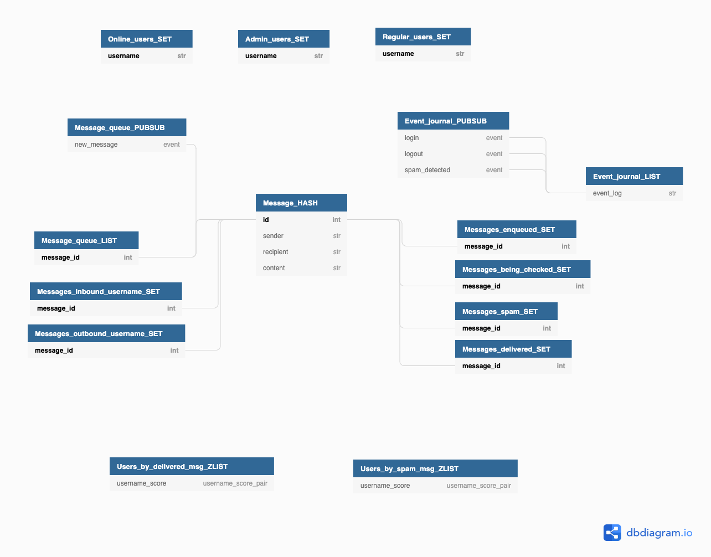

## Pre-requisites
You should have [poetry](https://python-poetry.org/) installed.

## Quickstart
```
poetry install
python3 app.py
```

## Redis Schema
[DB Diagram](https://dbdiagram.io/d/6040b727fcdcb6230b228eda)


## Calling the API
If you're a Mac user and have [Paw](https://paw.cloud/), you can use `lab2.paw`.

Otherwise here are some CURL commands you can run to invoke the API:

#### Login
```
curl -X "POST" "http://localhost:5000/login" \
     -H 'Content-Type: application/json; charset=utf-8' \
     -d $'{
  "username": "Dizzzmas"
}'
```
#### Logout
```
curl -X "POST" "http://localhost:5000/logout" \
     -H 'Content-Type: application/json; charset=utf-8' \
     -d $'{
  "username": "Dizzzmas"
}'
```
#### Send message
```
curl -X "POST" "http://localhost:5000/message" \
     -H 'Content-Type: application/json; charset=utf-8' \
     -d $'{
  "content": "My message",
  "recipient": "Ilya",
  "sender": "Dizzzmas"
}'
```
#### Send reply
```
curl -X "POST" "http://localhost:5000/message" \
     -H 'Content-Type: application/json; charset=utf-8' \
     -d $'{
  "content": "My reply",
  "recipient": "Dizzzmas",
  "sender": "Ilya"
}'
```
#### Fetch user's message stats
```
curl "http://localhost:5000/user-stats?username=Dizzzmas"
```
#### Fetch user's inbound messages
```
curl "http://localhost:5000/inbound-messages?username=Dizzzmas" \
     -H 'Content-Type: application/json; charset=utf-8' \
     -d $'{}'
```
#### Fetch spammers stats
```
curl "http://localhost:5000/spammer-stats"
```
#### Fetch chatter stats
```
curl "http://localhost:5000/chatter-stats"
```
#### Fetch online users
```
curl "http://localhost:5000/online-users"
```
#### Fetch event journal
```
curl "http://localhost:5000/event-journal"
```